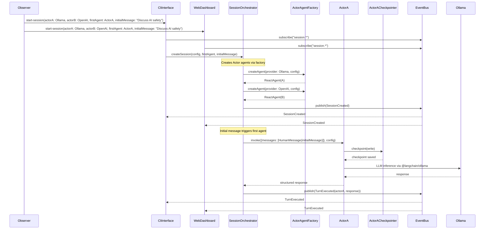
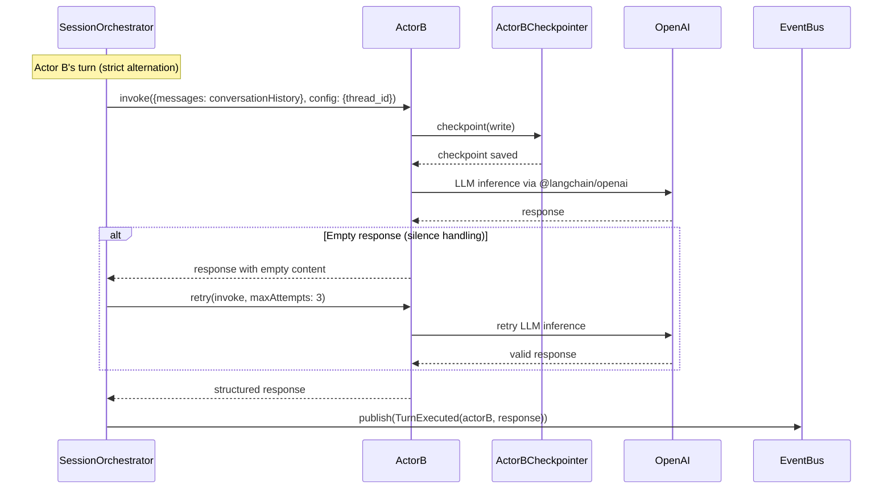
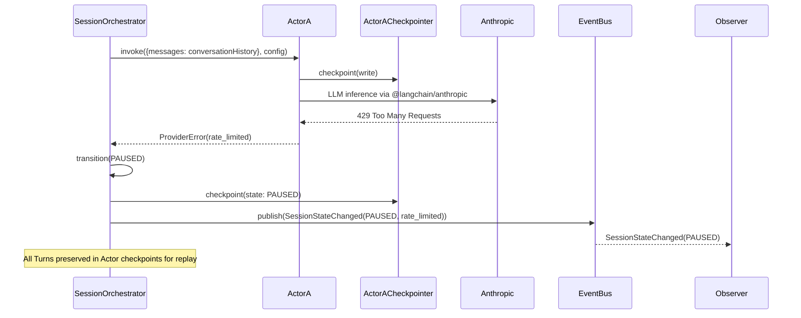
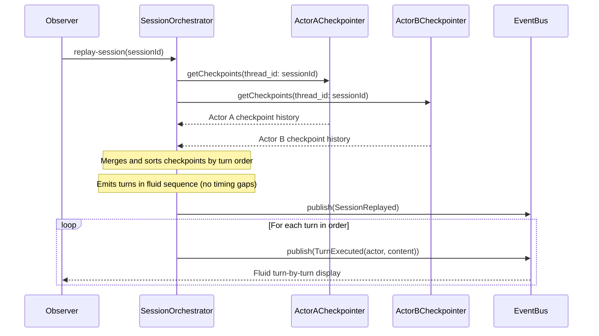

# Architecture Document: Emerge

**Version:** 2.0  
**Status:** Draft  
**Date:** February 5, 2026  
**Architectural Style:** Modular Monolith with LangGraph Agents and Event-Driven State Management

---

## 1. Architectural Strategy

### The Pattern: Modular Monolith with LangGraph Agent Orchestration

Per **Martin Fowler's** *MonolithFirst* strategy and **Sam Newman's** *Building Microservices*, introducing distributed system concerns (dual interfaces, real-time sync) too early creates an unnecessary "Microservices Premium" that a solo developer cannot sustain. The Emerge system will be a **Modular Monolith**—a single deployable unit with strict internal boundaries between domains.

**Key Technology Decision:** The system will use **LangChain's `createAgent()`** function to implement each Actor as a LangGraph agent. This provides:
- **Built-in ReAct Reasoning Loop:** The agent interleaves reasoning steps with tool calls automatically.
- **Custom Checkpointers:** Each Actor agent uses the developer's Bun-based checkpointers for persistence, Turn history, and Session replay.
- **Structured Outputs:** LangChain's response formatting ensures consistent Turn data.

**Justification:**
- **Single Deployment Unit:** Eliminates distributed tracing, service discovery, and inter-service communication failures.
- **Custom Bun Checkpointers:** The developer provides plug-and-play checkpointers that satisfy the "no database" constraint while enabling P1 replay.
- **Reactive State Propagation:** The Session orchestrator emits events. Both CLI and Web Dashboard subscribe to these events, eliminating polling-induced load.
- **Native Provider Integration:** LangChain's `@langchain/{ollama,openai,anthropic}` packages provide built-in provider support, eliminating custom adapter code.

### Design Principles

| Principle | Application |
|-----------|-------------|
| **LangGraph Agent per Actor** | Each Actor (LLM instance) is a `createAgent()` instance with its own Bun-based checkpointer. This cleanly separates conversation history and state between Actors. |
| **Thread-Scoped Checkpoints** | Each Actor agent uses a `thread_id` corresponding to the Session ID. Replay is achieved by restoring from checkpoint history. |
| **Event-Carried State Transfer** | Instead of polling, components subscribe to state changes via the EventBus. |
| **LangChain Provider Packages** | Use official `@langchain/ollama`, `@langchain/openai`, `@langchain/anthropic` packages instead of custom adapters. |
| **Fail-Fast Validation** | Provider health checks execute before Session start. Runtime failures trigger immediate state transition to `PAUSED` with diagnostic context. |

---

## 2. System Containers (C4 Level 2)

> **Terminology Note:** "Container" here uses the **C4 Model** (Simon Brown's *Software Architecture for Developers*), not Docker. A Container is a **deployable/runnable unit**—a process boundary that executes code or stores data. In this Modular Monolith, all Containers run within a single Bun process. They are logical boundaries that could later be split into Docker containers if scaling is needed, but are not required to do so now.

The system is decomposed into **logical containers** that represent deployable units or significant runtime boundaries.

### Container: `SessionOrchestrator`

| Attribute | Value |
|-----------|-------|
| **Type** | Core Domain Service |
| **Responsibility** | Manages the dialogue loop, Turn lifecycle, and Session state machine. Enforces strict turn alternation, turn limits, and stewardship controls. Coordinates Actor agents via `agent.invoke()` calls. Accepts initial message and first agent selection from Observer to trigger conversation. |
| **Inbound Protocols** | HTTP (JSON-RPC style), WebSocket (event subscription), CLI commands (TTY stdin) |
| **Outbound Protocols** | Emits `TurnExecuted`, `SessionStateChanged`, `ErrorOccurred` events; invokes Actor agents |
| **Persistence** | Session metadata; Actor checkpoints via developer's Bun checkpointers; File-based export via `ExportEngine` |

### Container: `ActorAgentFactory`

| Attribute | Value |
|-----------|-------|
| **Type** | Factory Service |
| **Responsibility** | Creates and configures LangGraph `createAgent()` instances for each Actor. Handles Provider initialization and system prompt injection. Receives custom checkpointers from SessionOrchestrator. |
| **Inbound Protocols** | Actor configuration, custom checkpointers from SessionOrchestrator |
| **Outbound Protocols** | Returns configured `ReactAgent` instances |
| **Dependencies** | `@langchain/langgraph`, `@langchain/ollama`, `@langchain/openai`, `@langchain/anthropic` |

### Container: `CliInterface`

| Attribute | Value |
|-----------|-------|
| **Type** | Frontend/CLI |
| **Responsibility** | Real-time terminal output for monitoring and control. Subscribes to Session events via `EventBus`. Provides interactive commands (`start`, `pause`, `inject`, `export`). |
| **Inbound Protocols** | TTY stdin (user input), `EventBus` subscription |
| **Outbound Protocols** | Formatted terminal output (ANSI), `CommandBus` for sending actions |
| **Transport** | Stdio/stdin with `Bun.serve` HMR integration for development |

### Container: `WebDashboard`

| Attribute | Value |
|-----------|-------|
| **Type** | Frontend/SPA |
| **Responsibility** | Browser-based UI for Session visualization, replay, and configuration. Provides real-time updates via WebSocket. |
| **Inbound Protocols** | HTTP (static assets), WebSocket (event stream) |
| **Outbound Protocols** | HTTP API calls for configuration, WebSocket subscription for live events |
| **Tech Stack** | React (via HTML imports), Tailwind CSS, native `WebSocket` API |

### Container: `ExportEngine`

| Attribute | Value |
|-----------|-------|
| **Type** | Utility Service |
| **Responsibility** | Serializes Sessions to JSON (full metadata) and Markdown (human-readable transcript). Exports checkpoint history for external analysis. |
| **Inbound Protocols** | `ExportRequest` from `SessionOrchestrator` or API |
| **Outbound Protocols** | Filesystem writes (`Bun.file`) |
| **Format** | `session-{id}.json`, `session-{id}.md` |

### Container: `EventBus`

| Attribute | Value |
|-----------|-------|
| **Type** | Infrastructure/Message Broker |
| **Responsibility** | Central event distribution system. All state changes are published as events. Subscribers (CLI, WebSocket) receive events in real-time. |
| **Pattern** | Publish/Subscribe (Pub/Sub) |
| **Implementation** | In-memory event emitter for single-node deployment |

---

## 3. Container Diagram (Mermaid.js)

```mermaid
C4Container
  title Container Diagram for Emerge (LangGraph Architecture)

  Person_Ext(Observer, "Observer", "Human researcher")

  Container_Boundary(emerge_core, "Emerge Core") {
    Container(SessionOrchestrator, "Session Orchestrator", "TypeScript", "Manages dialogue loop and Turn lifecycle")
    Container(ActorAgentFactory, "Actor Agent Factory", "TypeScript", "Creates LangGraph createAgent() instances")
    
    Container_Boundary(checkpointers, "Custom Bun Checkpointers") {
      Container(ActorACheckpointer, "Actor A Checkpointer", "Bun Checkpointer", "Persists Actor A state")
      Container(BCheckpointer, "Actor B Checkpointer", "Bun Checkpointer", "Persists Actor B state")
    }
    
    Container(EventBus, "Event Bus", "In-Memory Pub/Sub", "Publishes state changes to subscribers")
    Container(ExportEngine, "Export Engine", "TypeScript", "JSON/Markdown serialization")
  }

  Container_Boundary(emerge_ui, "Emerge UI") {
    Container(CliInterface, "CLI Interface", "TypeScript/Bun", "Terminal monitoring and control")
    Container(WebDashboard, "Web Dashboard", "React/Tailwind", "Browser-based visualization")
  }

  System_Ext(Ollama, "Ollama", "Local LLM inference server")
  System_Ext(OpenAI, "OpenAI API", "Cloud LLM API (GPT-4)")
  System_Ext(Anthropic, "Anthropic API", "Cloud LLM API (Claude)")

  Rel(Observer, CliInterface, "Monitors and controls via terminal")
  Rel(Observer, WebDashboard, "Monitors and controls via browser")

  Rel(CliInterface, EventBus, "Subscribes to events")
  Rel(WebDashboard, EventBus, "Subscribes via WebSocket")

  Rel(EventBus, SessionOrchestrator, "Delivers commands")
  Rel(SessionOrchestrator, ActorAgentFactory, "Creates actor agents")

  Rel(SessionOrchestrator, ActorACheckpointer, "Writes/reads checkpoints")
  Rel(SessionOrchestrator, BCheckpointer, "Writes/reads checkpoints")

  Rel(SessionOrchestrator, ExportEngine, "Requests export")
  Rel(SessionOrchestrator, ActorA, "Invokes agent for turn")
  Rel(SessionOrchestrator, ActorB, "Invokes agent for turn")

  Rel(ActorA, Ollama, "LLM inference")
  Rel(ActorA, OpenAI, "LLM inference")
  Rel(ActorA, Anthropic, "LLM inference")

  Rel(ActorB, Ollama, "LLM inference")
  Rel(ActorB, OpenAI, "LLM inference")
  Rel(ActorB, Anthropic, "LLM inference")
```

### Protocol Legend

| Connection | Protocol | Justification |
|------------|----------|---------------|
| Observer ↔ CLI | TTY/stdin | Direct terminal interaction; minimal latency |
| Observer ↔ Web | HTTP + WebSocket | WebSocket for real-time event streaming; HTTP for static assets |
| CLI/Web ↔ EventBus | In-Memory + WebSocket Bridge | Single-node deployment; WebSocket bridges in-memory events to browser |
| Orchestrator ↔ Agents | In-Memory Function Calls | LangGraph agent invocation within same process |
| Agents ↔ Providers | HTTPS/REST | Provider-specific protocols via LangChain packages |

---

## 4. Critical Execution Flows (Sequence Diagrams)

### Flow 1: Session Initialization and Initial Message (P0)



### Flow 2: Strict Alternation (P0)



### Flow 3: Provider Failure and Pause (P1)



### Flow 4: Session Replay (Fluid Presentation) (P1)



---

## 5. LangGraph Agent Configuration

### 5.1 Actor Agent Structure

Each Actor is a LangGraph `createAgent()` instance. The framework handles message structure and persistence automatically:

```typescript
import { createAgent, HumanMessage } from "@langchain/langgraph";
import { initChatModel } from "@langchain/core/language_models/chat_models";
import { z } from "zod";

const responseFormat = z.object({
  content: z.string().describe("The actor's response message"),
  tokens_used: z.number().describe("Total tokens used in this turn"),
  reasoning_steps: z.array(z.string()).optional().describe("ReAct reasoning trace"),
});

// Create actor agent
const actorAgent = createAgent({
  model: await initChatModel("ollama:llama3.1", { temperature: 0.7 }),
  tools: [], // No external tools needed for dialogue
  systemPrompt: "You are a thoughtful AI assistant...",
  responseFormat,
  checkpointer: customBunCheckpointer, // Developer's plug-and-play checkpointer
});

// Initial message triggers first agent
const initialResult = await actorAgent.invoke(
  { messages: [new HumanMessage(initialMessage)] },
  { configurable: { thread_id: sessionId } }
);

// Subsequent turns pass conversation history
const subsequentResult = await actorAgent.invoke(
  { messages: conversationHistory },
  { configurable: { thread_id: sessionId } }
);
```

### 5.2 No Transformation Required

LangGraph's state channel handles each agent's perspective internally. We simply:
1. Invoke Agent A with the conversation history
2. Take Agent A's output and invoke Agent B with the combined history
3. Repeat (strict alternation)

Each agent treats the history as a user conversation. No message role transformation is needed—the framework handles it.

### 6. Resilience & Cross-Cutting Concerns

### 6.1 Authentication Strategy

| Provider | Auth Mechanism | LangChain Integration |
|----------|---------------|---------------------|
| **Ollama** | None (local) | `@langchain/ollama` - direct connection |
| **OpenAI** | Bearer Token | `@langchain/openai` - `OPENAI_API_KEY` env var |
| **Anthropic** | Bearer Token | `@langchain/anthropic` - `ANTHROPIC_API_KEY` env var |

**Strategy:** API keys are loaded from environment variables. LangChain packages handle authentication automatically.

### 6.2 Failure Handling Patterns

| Pattern | Location | Implementation |
|---------|----------|----------------|
| **Circuit Breaker** | `SessionOrchestrator → Actor Agent` | Track consecutive failures; pause after N failures |
| **Timeout** | `ActorAgent → Provider` | LangChain's built-in timeout on model initialization |
| **Retry with Backoff** | `ActorAgent → Provider` | LangChain's built-in retry on transient errors (429, 503) |
| **Turn Retry** | `SessionOrchestrator` | Retry empty responses up to 3 times before skipping |
| **Checkpointer Failover** | `Custom Bun Checkpointer` | Developer's implementation responsibility |

### 6.3 Observability Strategy

| Concern | Implementation |
|---------|----------------|
| **Structured Logging** | JSON logs with `{ level, timestamp, sessionId, event, data }` |
| **Checkpoint Metadata** | Each checkpoint includes: turn number, actor identity, provider, tokens |
| **Replay Presentation** | Fluid emission of turns; timing gaps omitted for readability |
| **Agent Tracing** | LangChain's built-in ReAct reasoning trace in checkpoint |

### 6.4 Configuration Management

| Layer | Format | Location |
|-------|--------|----------|
| **Environment** | `.env` file | Project root |
| **Actor Config** | TypeScript/JSON | `SessionOrchestrator` initialization |
| **LangChain Models** | Provider-specific | Via `@langchain/*` packages |
| **Checkpointer** | Custom Bun implementation | Developer's plug-and-play |

---

## 7. Provider Interface (LangChain)

Instead of custom adapters, use LangChain's official provider packages:

```typescript
// Ollama
import { ChatOllama } from "@langchain/ollama";
const model = new ChatOllama({
  model: "llama3.1",
  temperature: 0.7,
});

// OpenAI
import { ChatOpenAI } from "@langchain/openai";
const model = new ChatOpenAI({
  model: "gpt-4o",
  temperature: 0.7,
  apiKey: process.env.OPENAI_API_KEY,
});

// Anthropic
import { ChatAnthropic } from "@langchain/anthropic";
const model = new ChatAnthropic({
  model: "claude-sonnet-4-5-20250929",
  temperature: 0.7,
  apiKey: process.env.ANTHROPIC_API_KEY,
});
```

All models are passed to `createAgent()` with a unified interface.

---

## 8. Logical Risks & Technical Debt

| Risk | Severity | Mitigation |
|------|----------|------------|
| **LangChain Version Drift** | Medium | Pin `@langchain/*` versions in `package.json`; use exact versions |
| **Checkpoint Consistency** | High | Each Actor has independent checkpointer; replay reconstructs from both checkpoints |
| **Memory Usage with MemorySaver** | Medium | For MVP, acceptable. Plan SqliteSaver migration for long sessions. |
| **ReAct Agent Loop Duration** | Medium | Set `maxIterations` in `createAgent()` to prevent infinite loops |
| **Dual Interface Sync** | Medium | Both CLI and Web Dashboard subscribe to the same `EventBus`; no polling |

---

## 9. Directory Structure (Proposed)

```
emerge/
├── src/
│   ├── core/
│   │   ├── SessionOrchestrator.ts
│   │   ├── SessionState.ts
│   │   └── Turn.ts
│   ├── agents/
│   │   ├── ActorAgentFactory.ts
│   │   ├── actorConfig.ts
│   │   └── responseSchemas.ts
│   ├── checkpointers/
│   │   └── (Developer's Bun checkpointers - plug-and-play)
│   ├── events/
│   │   ├── EventBus.ts
│   │   └── EventTypes.ts
│   ├── cli/
│   │   ├── CliInterface.ts
│   │   └── commands/
│   ├── web/
│   │   ├── DashboardServer.ts
│   │   └── static/
│   │       ├── index.html
│   │       └── (React bundles)
│   └── export/
│       └── ExportEngine.ts
├── package.json
├── bunfig.toml
└── .env.example
```

---

## 10. Open Questions for the Product Definer

**Closed Questions (Confirmed):**
1. ✅ Strict alternation only (Actor A completes before Actor B speaks)
2. ✅ Retry on empty response (up to N attempts)
3. ✅ Replay preserves original timestamps from checkpoints

**Remaining Questions:**

1. **Checkpointer Storage:** For MVP, `MemorySaver` is in-memory only (loses data on restart). Should we use `SqliteSaver` from the start for true persistence?

2. **Replay Scope:** Should replay include "pauses" (periods where Session was paused), or only active Turn execution time?

3. **Checkpoint Frequency:** LangGraph checkpoints at each graph step. For dialogue, we want checkpoint after each complete Turn. Should we configure checkpointing behavior?

---

## 10. Summary of Confirmed Requirements

| Requirement | Confirmed | Implementation |
|-------------|-----------|----------------|
| **Strict Alternation** | ✅ | Actor B only invoked after Actor A completes |
| **Turn Retry** | ✅ | Empty responses retry up to 3 times |
| **Replay Presentation** | ✅ | Fluid emission of turns (timing gaps omitted) |
| **Custom Checkpointers** | ✅ | Developer's Bun-based plug-and-play checkpointers |
| **LangChain Providers** | ✅ | `@langchain/{ollama,openai,anthropic}` packages |
| **No Message Transformation** | ✅ | LangGraph handles agent perspective internally |
| **Initial Message** | ✅ | Observer selects first agent and provides initial message to trigger conversation |

---

**Architecture Version:** 2.0  
**Changes from v1.0:** Integrated LangChain `createAgent()` for Actor implementation; replaced custom Provider adapters with `@langchain/*` packages; added message role transformation logic; clarified checkpointer strategy (developer's custom implementation); updated replay to fluid presentation.