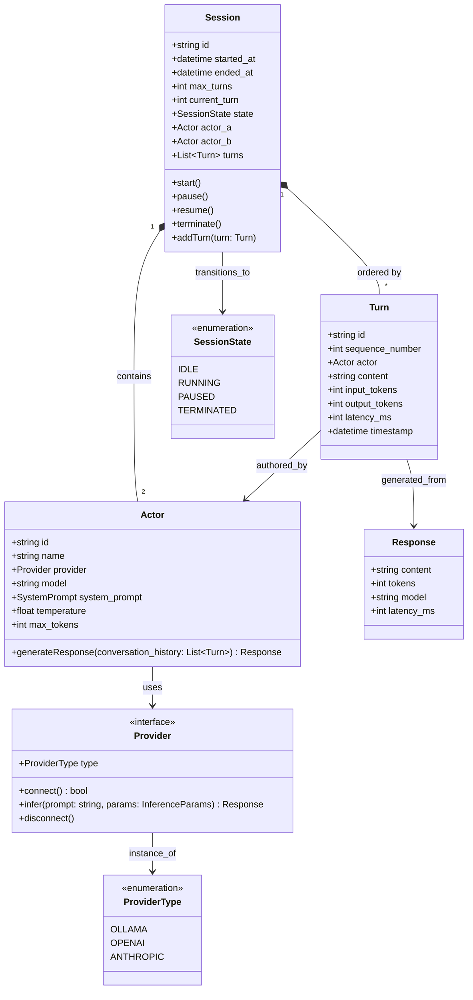

# Product Requirements Document: Emerge

**Version:** 1.0  
**Status:** Draft  
**Date:** February 5, 2026

---

## 1. Executive Summary

### The Vision
A research and educational platform that enables two LLM instances to engage in autonomous, open-ended conversation while providing the observer complete visibility and control over the interaction. The system serves as a laboratory for observing emergent behaviors, dialogue dynamics, and model-to-model communication patterns in isolation.

### The Problem
Current LLM interactions are predominantly human-mediated. While multi-agent frameworks exist for task completion, there is no accessible, purpose-built tool for the *observation* of autonomous LLM-to-LLM dialogue. Researchers, hobbyists, and AI safety researchers lack a standardized platform to study how models behave when freed from human conversational pacing and direction.

### Jobs to be Done

| Job Statement | Desired Outcome |
|---------------|-----------------|
| "As an AI safety researcher, I hire Emerge to generate autonomous model dialogues so that I can observe emergent behaviors and alignment drift over extended conversations." | Structured, observable dialogue logs with configurable parameters |
| "As a curious developer, I hire Emerge to let two LLMs chat so that I can witness unexpected conversation patterns and model 'personality' differences." | Real-time visualization and replay of dialogues |
| "As an AI educator, I hire Emerge to demonstrate LLM capabilities so that students can see how models interact without human intervention." | Educational replay and analysis tools |

---

## 2. Ubiquitous Language

> Ambiguity is the enemy of engineering. The following terms are authoritative and must be used consistently across all artifacts.

| Term | Definition | Do Not Use |
|------|------------|------------|
| **Actor** | An LLM instance participating in the dialogue. Each Actor has a Provider, Model, and configurable Behavioral Parameters. | Agent, Participant, Endpoint |
| **Provider** | The backend system that serves LLM inference. Examples: Ollama (local), OpenAI (cloud), Anthropic (cloud). | Backend, Service, Inference Engine |
| **Session** | A discrete run of the dialogue system with defined Actors. Contains the complete Turn history and metadata. | Conversation, Chat Session, Run |
| **Turn** | A single contribution from one Actor to the dialogue. Contains the message content and token metrics. | Message, Exchange, Contribution |
| **Dialogue** | The aggregate of all Turns exchanged between Actors within a Session. | Conversation, Chat Log |
| **Observer** | The human user who monitors, controls, and analyzes Sessions. | User, Viewer, Administrator |
| **Steward** | A configurable mechanism for the Observer to inject topics, pause, or terminate the Session. | Moderator, Controller, Interrupt |
| **Provider Abstraction Layer** | The unified interface that normalizes differences between Providers, enabling Actor configuration without Provider-specific code. | Adapter, Bridge, Connector |

---

## 3. Actors & Personas

### The Observer (Primary User)
**Psychographic Profile:** The Observer values curiosity over utility. They are willing to sacrifice polished UX for configurability. They want to understand *why* models behave as they do, not just *what* they say.

- **Core Motivations:**
  - Scientific curiosity about emergent AI behaviors
  - Educational demonstration of LLM capabilities
  - Research into alignment, safety, and dialogue dynamics
  
- **Behavioral Patterns:**
  - Starts Sessions, steps away, returns to analyze logs
  - Frequently rewinds to specific Turns for detailed examination
  - Adjusts Actor parameters mid-Session to test hypotheses
  - Exports logs for external analysis

- **Pain Points:**
  - Lack of visibility into token-level decision making
  - No standardized format for sharing dialogue logs
  - Difficulty comparing behavior across different model/provider combinations

---

## 4. Functional Capabilities

### Epic 1: Session Management (P0)

| Capability | Description | Priority |
|------------|-------------|----------|
| **Initiate Session** | Observer creates a new Session by selecting two Actors with distinct Providers and Models. | P0 |
| **Configure Actors** | Observer sets Temperature, Max Tokens, System Prompt, and Behavioral Parameters for each Actor. | P0 |
| **Start/Pause/Resume** | Observer controls Session execution state. | P0 |
| **Terminate Session** | Observer ends the Session at any time, preserving all Turns. | P0 |
| **Session Metadata** | System records start time, duration, Providers used, and configuration snapshot. | P0 |

### Epic 2: Provider Integration (P0)

| Capability | Description | Priority |
|------------|-------------|----------|
| **Provider Abstraction** | Unified interface supporting at minimum: Ollama (local), OpenAI API, Anthropic API. | P0 |
| **Local Provider Support** | Actor can connect to locally-running inference servers (Ollama, LM Studio, llama.cpp). | P0 |
| **Cloud Provider Support** | Actor can connect to cloud API endpoints with API key authentication. | P0 |
| **Provider Health Check** | System validates Provider connectivity before Session start. | P1 |
| **Fallback Behavior** | If one Provider fails mid-Session, system alerts Observer and pauses rather than fail silently. | P1 |

### Epic 3: Dialogue Execution (P0)

| Capability | Description | Priority |
|------------|-------------|----------|
| **Alternating Turns** | Actors alternate turns automatically. Observer can configure turn order and count. | P0 |
| **Turn Execution** | System sends Actor's prompt to Provider, receives response, emits Turn event. | P0 |
| **Turn History** | Each Turn records: Actor identity, message content, token count, latency, model metadata. | P0 |
| **Turn Limit** | Observer sets maximum Turns per Session to prevent runaway execution. | P0 |
| **Silence Handling** | If an Actor returns empty content, system logs and skips to next Actor. | P1 |

### Epic 4: Observability Interface (P0)

| Capability | Description | Priority |
|------------|-------------|----------|
| **Terminal Output** | Real-time CLI display of Turns as they occur with minimal formatting. | P0 |
| **Web Dashboard** | Browser-based UI showing active Sessions, Turn history, and Actor status. | P0 |
| **Live Stream** | WebSocket or polling-based real-time updates to the Dashboard. | P0 |
| **Session Replay** | Observer can replay past Sessions from Turn history. | P1 |
| **Turn Diff** | Visual comparison between consecutive Turns from different Actors. | P2 |

### Epic 5: Stewardship Controls (P1)

| Capability | Description | Priority |
|------------|-------------|----------|
| **Topic Injection** | Observer can inject a topic prompt into the next Turn without modifying System Prompt. | P1 |
| **Interrupt** | Observer can halt execution between Turns for inspection. | P1 |
| **Mid-Session Reconfiguration** | Observer can modify Actor parameters mid-Session; changes apply on next Turn. | P2 |
| **Behavior Tags** | Observer can annotate Turns with custom tags for later analysis. | P2 |

### Epic 6: Export & Analysis (P2)

| Capability | Description | Priority |
|------------|-------------|---------- |
| **Export to JSON** | Full Session export including all metadata for external analysis. | P2 |
| **Export to Markdown** | Human-readable dialogue transcript for documentation. | P2 |
| **Token Usage Report** | Summary of token consumption per Actor for cost tracking. | P2 |
| **Search/Filter** | Observer can search Turns by content, Actor, or timestamp. | P2 |

---

## 5. Non-Functional Constraints

| Category | Constraint |
|----------|-------------|
| **Availability** | Dashboard and API must remain responsive during active Sessions. CLI output must not block on network I/O. |
| **Latency** | Turn-to-turn latency should be minimized; prefer asynchronous Provider calls with callback or streaming support. |
| **Extensibility** | New Providers must be addable without modifying core Session logic. Define a Provider Interface Specification. |
| **Portability** | No binary dependencies beyond Bun runtime. Configuration must be file-based (no database required for MVP). |
| **Observability** | All system errors must be logged with sufficient context to diagnose Provider integration issues. |
| **Accessibility** | CLI output must be readable via screen readers (minimal ANSI codes, plain text fallback). |

---

## 6. Boundary Analysis

### In Scope (MVP)

1. **Core Dialogue Loop:** Two Actors exchanging Turns until terminated or limit reached.
2. **Provider Flexibility:** Support for at least three Providers (Ollama, OpenAI, Anthropic) in hybrid configuration.
3. **Dual Interface:** Functional CLI and Web Dashboard for observation.
4. **Turn Persistence:** Complete Turn history within a Session.
5. **Session Controls:** Start, Pause, Resume, Terminate with Turn limits.

### Out of Scope (Anti-Scope)

1. **Complex Multi-Agent Architectures:** No task decomposition, planning hierarchies, or agent tool-use frameworks. This is *dialogue*, not task execution.
2. **Built-in Evaluation:** No automatic scoring of dialogue quality, coherence, or safety. Export for external analysis only.
3. **User Authentication:** No multi-user support or access controls. Single-Observer local use only.
4. **Persistent Storage:** SQLite checkpointer for session persistence. Sessions persisted to local SQLite database with configurable checkpoint intervals.
5. **Real-time Voice/Audio:** Text-only dialogue. Audio synthesis is out of scope for MVP.

---

## 7. Conceptual Diagrams

### Diagram A: System Context (C4 Level 1)

```mermaid
C4Context
  title System Context Diagram for Emerge

  Person_Ext(Observer, "Observer", "A human researcher observing autonomous LLM dialogue")

  System_Boundary(emerge, "Emerge System") {
    System_UI_CLI(emerge_cli, "CLI Interface", "Real-time terminal output and control")
    System_UI_Web(emerge_web, "Web Dashboard", "Browser-based visualization and replay")
    System_Core(emerge_core, "Session Orchestrator", "Manages dialogue loop and Turn lifecycle")
    System_Provider(emerge_provider, "Provider Abstraction Layer", "Normalizes Ollama, OpenAI, Anthropic APIs")
    System_Export(emerge_export, "Export Engine", "JSON and Markdown serialization")
  }

  System_Ext(ollama, "Ollama", "Local LLM inference server")
  System_Ext(openai, "OpenAI API", "Cloud LLM API (GPT-4, GPT-3.5)")
  System_Ext(anthropic, "Anthropic API", "Cloud LLM API (Claude)")

  Rel(Observer, emerge_cli, "Monitors and controls via terminal")
  Rel(Observer, emerge_web, "Monitors and controls via browser")
  Rel(emerge_cli, emerge_core, "Commands and events")
  Rel(emerge_web, emerge_core, "Commands and events via WebSocket/HTTP")
  Rel(emerge_core, emerge_provider, "Sends prompts, receives completions")
  Rel(emerge_core, emerge_export, "Requests session export")
  Rel(emerge_provider, ollama, "REST/HTTP")
  Rel(emerge_provider, openai, "HTTPS API")
  Rel(emerge_provider, anthropic, "HTTPS API")
```

### Diagram B: Core Domain Model



---

## 8. Appendix: Operator Preferences

> The following preferences were expressed by the Operator (Developer) and are documented for the Architecture Agent. They do not constitute requirements but should be considered during solution design.

| Preference | Notes |
|------------|-------|
| **Runtime** | Bun (preferred over Node.js) |
| **Framework** | Bun.serve for HTTP/WebSocket server; HTML imports with Bun for frontend |
| **Styling** | Tailwind CSS for web dashboard |
| **Frontend Library** | React (supported via HTML imports) |
| **Local Model Support** | Ollama should be first-class; consider LM Studio compatibility |
| **No External Services** | All tooling should run locally; no third-party SaaS dependencies |

---

## 9. Next Steps

1. **Architecture Review:** Forward this PRD to the Architecture Agent for technical design and Provider Interface Specification.
2. **Provider Matrix:** Define the minimum required API contracts for Ollama, OpenAI, and Anthropic integrations.
3. **CLI Prototype:** Begin with CLI-only implementation to validate the dialogue loop before adding web interface.
4. **Web Dashboard Scope:** Refine dashboard requirements once CLI proves the core interaction model.