# Execution Plan: Emerge

**Version:** 1.0  
**Status:** Ready for Development  
**Date:** February 6, 2026  
**Planner:** Technical Project Manager (Agent)

---

## 1. Executive Summary

This document provides a granular, ordered breakdown of implementation tasks derived from the Architecture.md (v2.0) and TechSpec.md (v1.1). The plan follows the **Modular Monolith** architecture with LangGraph agent orchestration, using custom Bun-based checkpointers for persistence.

### Total Estimation

| Phase | Tasks | Total Story Points |
|-------|-------|-------------------|
| **Phase 1 (MVP)** | 17 tasks | **34 points** |
| **Phase 2 (Post-Launch)** | 8 tasks | 16 points |
| **TOTAL** | 25 tasks | **50 points** |

**Note:** Checkpointer database schema is managed by the custom Bun checkpointer implementation and is not part of the application database schema tasks.

### Critical Path (Longest Dependency Chain)

The following sequence represents the **bottleneck** that determines project duration:

1. `[TASK-001]` → `[TASK-002]` → `[TASK-003]` → `[TASK-004]` → `[TASK-005]` → `[TASK-009]` → `[TASK-010]` → `[TASK-011]` → `[TASK-014]` → `[TASK-015]` → `[TASK-018]`

**Critical Path Duration:** Determined by story points

---

## 2. Project Phasing Strategy

### Phase 1: MVP (Minimum Viable Product) ✅ P0

**Goal:** Deliver a working conversation orchestration system with both CLI and Web interfaces.

**Functional Outcomes:**
- ✅ Create and manage AI conversation sessions with two actors
- ✅ Execute turn-based dialogue with strict alternation
- ✅ Persist session state using custom Bun checkpointers
- ✅ Real-time event broadcasting via WebSocket
- ✅ Terminal UI for monitoring and control
- ✅ Web Dashboard for session visualization
- ✅ Export sessions to JSON and Markdown

**Deferred to Phase 2:**
- Session replay with checkpoint navigation
- Provider failure recovery and retry logic
- Advanced injection controls
- Session search and filtering
- Performance analytics

### Phase 2: Post-Launch Enhancements 📋 P1

**Goal:** Production-hardening and advanced features based on MVP feedback.

- Session replay with time-travel (checkpoint navigation)
- Provider failure recovery with circuit breaker
- Advanced topic injection with targeting
- Session search and filtering
- Performance analytics and metrics
- Multi-session concurrency
- Provider health monitoring

---

## 3. Build Order (Dependency Graph)

**Architecture Note:** The system uses **two separate SQLite databases**:
1. **Application Database** (`emerge.sqlite`): Sessions, turns, actors, events, providers
2. **Checkpointer Database** (`emerge_checkpoints.sqlite`): LangGraph state persistence (managed by checkpointer)

```mermaid
flowchart LR
    subgraph INFRA["Infrastructure Phase"]
        TASK-001[TASK-001: Project Setup]
        TASK-002[TASK-002: App Database Schema]
        TASK-003[TASK-003: Checkpointer Integration]
    end
    
    subgraph DOMAIN["Core Domain Phase"]
        TASK-004[TASK-004: Domain Entities]
        TASK-005[TASK-005: State Machine]
        TASK-006[TASK-006: EventBus]
    end
    
    subgraph PROVIDERS["Provider Phase"]
        TASK-007[TASK-007: Provider Factory]
        TASK-008[TASK-008: Provider Impl]
    end
    
    subgraph AGENTS["Agent Phase"]
        TASK-009[TASK-009: Response Schemas]
        TASK-010[TASK-010: ActorAgentFactory]
    end
    
    subgraph ORCHESTRATION["Orchestration Phase"]
        TASK-011[TASK-011: SessionOrchestrator]
        TASK-012[TASK-012: TurnExecutor]
        TASK-013[TASK-013: Strict Alternation]
    end
    
    subgraph INTERFACES["Interface Phase"]
        TASK-014[TASK-014: CLI Interface]
        TASK-015[TASK-015: Web Dashboard]
        TASK-016[TASK-016: WebSocket Bridge]
    end
    
    subgraph EXPORT["Export Phase"]
        TASK-017[TASK-017: Export Engine]
    end
    
    subgraph TESTING["Testing Phase"]
        TASK-018[TASK-018: Unit Tests]
        TASK-019[TASK-019: Integration Tests]
    end
    
    TASK-001 --> TASK-002
    TASK-002 --> TASK-003
    TASK-003 --> TASK-004
    TASK-004 --> TASK-005
    TASK-004 --> TASK-006
    TASK-005 --> TASK-007
    TASK-006 --> TASK-007
    TASK-007 --> TASK-008
    TASK-008 --> TASK-009
    TASK-009 --> TASK-010
    TASK-010 --> TASK-011
    TASK-011 --> TASK-012
    TASK-011 --> TASK-013
    TASK-012 --> TASK-014
    TASK-012 --> TASK-015
    TASK-013 --> TASK-014
    TASK-013 --> TASK-015
    TASK-014 --> TASK-016
    TASK-015 --> TASK-016
    TASK-016 --> TASK-017
    TASK-017 --> TASK-018
    TASK-018 --> TASK-019
```



---

## 4. The Ticket List

### Epic 1: Infrastructure Setup

#### [TASK-001] Project Initialization and Configuration
- **Type:** Chore
- **Effort:** 2 points
- **Dependencies:** None
- **Description:** Set up the Bun TypeScript project structure with Biome linting, Ultracite formatting, and base configuration files.
- **Acceptance Criteria (Gherkin):**
```gherkin
Given a fresh directory
When I run "bun install" with the configured package.json
Then all dependencies should install without errors
And "bun tsc --strict" should pass without type errors
And "bun x biome check" should pass linting requirements
```

#### [TASK-002] Application Database Schema Creation
- **Type:** Chore
- **Effort:** 3 points
- **Dependencies:** [TASK-001]
- **Description:** Implement SQLite database schema for application data (sessions, turns, actor_configs, events, providers). Note: The checkpointer uses a **separate database file** with its own schema managed by the checkpointer implementation.
- **Acceptance Criteria (Gherkin):**
```gherkin
Given the application database is initialized
When I query the schema information
Then I should find the following tables: sessions, turns, actor_configs, events, providers
And each table should have the columns specified in TechSpec Section 3.2
And all foreign key relationships should be correctly defined
And indexes should exist on session_id columns for performance
And the checkpointer database should be a separate file (emerge_checkpoints.sqlite)
```

#### [TASK-003] Custom Bun Checkpointer Integration
- **Type:** Spike
- **Effort:** 5 points
- **Dependencies:** [TASK-002]
- **Description:** Integrate the custom Bun-based checkpointer for LangGraph persistence. The checkpointer manages its own SQLite database file and schema. This is a SPIKE to verify integration with LangGraph's checkpointer interface.
- **Acceptance Criteria (Gherkin):**
```gherkin
Given the custom Bun checkpointer implementation
When it is instantiated
Then it should create/open a separate checkpoint database file
When LangGraph invokes the checkpointer with thread_id (sessionId)
Then checkpoints should be persisted to the checkpointer database
When the session orchestrator needs to replay
Then checkpoints should be retrievable by thread_id
And the application database should remain independent
```

---

### Epic 2: Core Domain Layer

#### [TASK-004] Domain Entities Implementation
- **Type:** Feature
- **Effort:** 3 points
- **Dependencies:** [TASK-003]
- **Description:** Implement domain entities (Session, Turn, Actor, ActorConfig) with Zod validation per TechSpec Section 9.
- **Acceptance Criteria (Gherkin):**
```gherkin
Given valid actor configuration data
When I create an ActorConfig instance
Then it should validate against the Zod schema
And it should serialize correctly to JSON
When I create a Session instance with actors
Then the session should have a unique UUID
And the session should initialize in IDLE state
```

#### [TASK-005] Session State Machine
- **Type:** Feature
- **Effort:** 2 points
- **Dependencies:** [TASK-004]
- **Description:** Implement SessionStateMachine with valid state transitions (IDLE → RUNNING → PAUSED → TERMINATED).
- **Acceptance Criteria (Gherkin):**
```gherkin
Given a SessionStateMachine in IDLE state
When I call transition(RUNNING)
Then the state should be RUNNING
When I call transition(PAUSED) from RUNNING
Then the state should be PAUSED
When I call transition(TERMINATED) from PAUSED
Then the state should be TERMINATED
When I call transition(RUNNING) from TERMINATED
Then an InvalidStateTransitionError should be thrown
```

#### [TASK-006] EventBus Implementation
- **Type:** Feature
- **Effort:** 2 points
- **Dependencies:** [TASK-004]
- **Description:** Implement in-memory EventBus with publish/subscribe pattern and event type definitions.
- **Acceptance Criteria (Gherkin):**
```gherkin
Given an EventBus instance
When I subscribe to "session.*" events
And I publish a SessionCreatedEvent
Then my subscriber should receive the event
When I publish multiple events of different types
Then I should be able to filter by exact event type
And unsubscribing should stop event delivery
```

---

### Epic 3: Provider Integration

#### [TASK-007] Provider Factory
- **Type:** Feature
- **Effort:** 2 points
- **Dependencies:** [TASK-005], [TASK-006]
- **Description:** Implement ProviderFactory to create ChatOllama, ChatOpenAI, and ChatAnthropic instances based on configuration.
- **Acceptance Criteria (Gherkin):**
```gherkin
Given a ProviderFactory with valid configuration
When I call createProvider("OLLAMA", config)
Then I should receive a ChatOllama instance
When I call createProvider("OPENAI", config)
Then I should receive a ChatOpenAI instance
When I call createProvider("ANTHROPIC", config)
Then I should receive a ChatAnthropic instance
When I call with an invalid provider type
Then a ProviderCreationError should be thrown
```

#### [TASK-008] Individual Provider Implementations
- **Type:** Feature
- **Effort:** 3 points
- **Dependencies:** [TASK-007]
- **Description:** Implement individual provider classes with proper authentication and configuration handling.
- **Acceptance Criteria (Gherkin):**
```gherkin
Given Ollama provider configuration with base_url
When I instantiate ChatOllama
Then it should connect to the specified endpoint
Given OpenAI provider configuration with api_key
When I instantiate ChatOpenAI
Then it should use the API key for authentication
Given Anthropic provider configuration with api_key
When I instantiate ChatAnthropic
Then it should use the API key for authentication
```

---

### Epic 4: LangGraph Agent Integration

#### [TASK-009] Response Schemas
- **Type:** Feature
- **Effort:** 1 point
- **Dependencies:** [TASK-008]
- **Description:** Define Zod schemas for agent response formats (content, tokens_used, reasoning_steps).
- **Acceptance Criteria (Gherkin):**
```gherkin
Given a TurnResponse schema
When I validate a response object
Then it should require content (string)
And it should require tokens_used (number)
And it should optionally allow reasoning_steps (array)
And validation should fail for missing required fields
```

#### [TASK-010] ActorAgentFactory
- **Type:** Feature
- **Effort:** 5 points
- **Dependencies:** [TASK-009]
- **Description:** Implement ActorAgentFactory to create LangChain createAgent() instances with custom checkpointers and response formatting.
- **Acceptance Criteria (Gherkin):**
```gherkin
Given a provider instance and actor configuration
When I call createActorAgent with systemPrompt and checkpointer
Then I should receive a configured createAgent instance
When I invoke the agent with a HumanMessage
Then it should process through LangGraph and return structured response
When the agent executes
Then checkpoints should be saved via the provided checkpointer
```

---

### Epic 5: Session Orchestration

#### [TASK-011] SessionOrchestrator Core
- **Type:** Feature
- **Effort:** 8 points
- **Dependencies:** [TASK-010]
- **Description:** Implement the core SessionOrchestrator managing session lifecycle, actor coordination, and event emission.
- **Acceptance Criteria (Gherkin):**
```gherkin
Given a SessionOrchestrator with valid configuration
When I call createSession with actors and initial message
Then a new session should be created in IDLE state
And actors should be initialized via ActorAgentFactory
When I call startSession
Then the state should transition to RUNNING
And the first actor should execute their turn
When I call pauseSession
Then the state should transition to PAUSED
And no further turns should execute
```

#### [TASK-012] TurnExecutor
- **Type:** Feature
- **Effort:** 3 points
- **Dependencies:** [TASK-011]
- **Description:** Implement TurnExecutor to handle individual turn execution with timing, token tracking, and event emission.
- **Acceptance Criteria (Gherkin):**
```gherkin
Given an active session with actors
When I execute a turn for an actor
Then the actor's agent should be invoked with conversation history
And the response should include content, tokens, and latency
And a TurnExecutedEvent should be published
When the response is empty
Then the turn should be retried up to 3 times
```

#### [TASK-013] Strict Alternation Logic
- **Type:** Feature
- **Effort:** 3 points
- **Dependencies:** [TASK-011]
- **Description:** Implement strict alternation enforcement ensuring Actor A completes before Actor B speaks.
- **Acceptance Criteria (Gherkin):**
```gherkin
Given a session with two actors (A and B)
When Actor A completes a turn
Then Actor B should be the next to execute
When Actor B completes a turn
Then Actor A should be the next to execute
When the session is configured for Actor B to start
Then Actor B should execute first
And Actor A should execute second
```

---

### Epic 6: User Interfaces

#### [TASK-014] CLI Interface (OpenTUI)
- **Type:** Feature
- **Effort:** 5 points
- **Dependencies:** [TASK-012], [TASK-013]
- **Description:** Implement OpenTUI-based terminal interface for session monitoring and control.
- **Acceptance Criteria (Gherkin):**
```gherkin
Given the CLI application is running
When I run the "start-session" command with valid configuration
Then I should see real-time turn-by-turn output
And I should be able to pause the session
And I should be able to inject topics
When I run "list-sessions"
Then I should see all sessions with their states
```

#### [TASK-015] Web Dashboard
- **Type:** Feature
- **Effort:** 5 points
- **Dependencies:** [TASK-012], [TASK-013]
- **Description:** Implement React-based web dashboard with shadcn/ui components and TanStack Query for state management.
- **Acceptance Criteria (Gherkin):**
```gherkin
Given the web dashboard is accessible
When I navigate to the sessions page
Then I should see a list of all sessions
When I click on an active session
Then I should see real-time updates via WebSocket
When I click on a completed session
Then I should see the full conversation transcript
```

#### [TASK-016] WebSocket Event Bridge
- **Type:** Feature
- **Effort:** 3 points
- **Dependencies:** [TASK-014], [TASK-015]
- **Description:** Implement WebSocket bridge to broadcast in-memory events to connected web clients.
- **Acceptance Criteria (Gherkin):**
```gherkin
Given a WebSocket connection to /ws
When I subscribe to session events
And a TurnExecuted event occurs
Then I should receive a JSON message with event type and payload
When I disconnect
Then I should stop receiving events
When I reconnect with a sessionId
Then I should receive the current session state
```

---

### Epic 7: Export Functionality

#### [TASK-017] Export Engine
- **Type:** Feature
- **Effort:** 3 points
- **Dependencies:** [TASK-016]
- **Description:** Implement ExportEngine to serialize sessions to JSON and Markdown formats.
- **Acceptance Criteria (Gherkin):**
```gherkin
Given a completed session with turns
When I export to JSON format
Then I should receive a JSON file with full session metadata
And turns should be in chronological order
When I export to Markdown format
Then I should receive a human-readable transcript
And actors should be clearly labeled
```

---

### Epic 8: Testing

#### [TASK-018] Unit Tests
- **Type:** Chore
- **Effort:** 3 points
- **Dependencies:** [TASK-017]
- **Description:** Write unit tests for core components using bun test.
- **Acceptance Criteria (Gherkin):**
```gherkin
When I run "bun test"
Then all unit tests should pass
And test coverage should be above 80% for:
  - SessionStateMachine transitions
  - TurnExecutor execution
  - EventBus publishing/subscription
  - Domain entity validation
```

#### [TASK-019] Integration Tests
- **Type:** Chore
- **Effort:** 5 points
- **Dependencies:** [TASK-018]
- **Description:** Write integration tests for full session lifecycle.
- **Acceptance Criteria (Gherkin):**
```gherkin
Given Ollama is running locally with a model loaded
When I execute the full integration test suite
Then a session should be created successfully
And turns should execute with strict alternation
And events should be published to subscribers
And the session should export correctly
And all tests should pass without errors
```

---

## Phase 2: Post-Launch Enhancements (Deferred)

### [TASK-020] Session Replay with Time Travel
- **Type:** Feature
- **Effort:** 5 points
- **Dependencies:** [TASK-019]
- **Description:** Implement checkpoint-based session replay with navigation controls.
- **Acceptance Criteria:**
```gherkin
Given a completed session with checkpoints
When I start a replay session
Then turns should be emitted in fluid sequence
And I should be able to pause/resume the replay
And I should be able to jump to specific checkpoints
```

### [TASK-021] Provider Failure Recovery
- **Type:** Feature
- **Effort:** 3 points
- **Dependencies:** [TASK-019]
- **Description:** Implement circuit breaker pattern and automatic retry with exponential backoff.
- **Acceptance Criteria:**
```gherkin
Given a provider returns 429 Too Many Requests
When the failure threshold is reached
Then the session should pause with diagnostic context
And the operator should be notified
When the provider recovers
Then the session should be resumable
```

### [TASK-022] Advanced Topic Injection
- **Type:** Feature
- **Effort:** 2 points
- **Dependencies:** [TASK-019]
- **Description:** Implement targeted injection to specific actors with priority override.
- **Acceptance Criteria:**
```gherkin
When I inject a topic targeting Actor B
Then Actor B should receive the topic on their next turn
And the topic should be injected even if Actor A is next in sequence
```

### [TASK-023] Session Search and Filtering
- **Type:** Feature
- **Effort:** 2 points
- **Dependencies:** [TASK-019]
- **Description:** Implement SQL-based search across session content and metadata.
- **Acceptance Criteria:**
```gherkin
When I search for sessions containing "AI safety"
Then I should receive matching sessions
And results should include turn-level matches
And search should complete in under 500ms
```

### [TASK-024] Performance Analytics
- **Type:** Feature
- **Effort:** 2 points
- **Dependencies:** [TASK-019]
- **Description:** Implement metrics collection and dashboard for performance monitoring.
- **Acceptance Criteria:**
```gherkin
When I view the analytics dashboard
Then I should see average turn latency
And I should see token usage per provider
And I should see session completion rates
```

### [TASK-025] Multi-Session Concurrency
- **Type:** Feature
- **Effort:** 3 points
- **Dependencies:** [TASK-019]
- **Description:** Implement support for multiple concurrent sessions with resource management.
- **Acceptance Criteria:**
```gherkin
When I start multiple sessions concurrently
Then each session should execute independently
And provider rate limits should be respected
And system memory should remain stable
```

### [TASK-026] Provider Health Monitoring
- **Type:** Feature
- **Effort:** 2 points
- **Dependencies:** [TASK-019]
- **Description:** Implement proactive health checks for all configured providers.
- **Acceptance Criteria:**
```gherkin
When a provider becomes unhealthy
Then I should receive an alert
And new sessions should not use unhealthy providers
And existing sessions should gracefully handle failures
```

### [TASK-027] E2E Test Suite
- **Type:** Chore
- **Effort:** 2 points
- **Dependencies:** [TASK-019]
- **Description:** Implement Playwright-based end-to-end tests for CLI and Web interfaces.
- **Acceptance Criteria:**
```gherkin
When I run the E2E test suite
Then CLI command execution should work correctly
And Web Dashboard interactions should work correctly
And all user flows should complete successfully
```

---

## 5. Risk Register

| Risk | Severity | Mitigation Strategy |
|------|----------|-------------------|
| **LangChain Version Drift** | Medium | Pin exact `@langchain/*` versions in package.json; use exact versions per TechSpec Section 10 |
| **Ollama Connectivity** | Medium | Add provider health check before session start; graceful degradation |
| **Dual Database Consistency** | High | Two separate databases (app + checkpointer). Replay requires both to be available. Implement coordinated backup/restore |
| **Memory Usage** | Medium | Monitor long sessions; checkpointer manages its own storage concerns |
| **WebSocket Scalability** | Low | In-memory implementation suitable for single-node; external broker for future scaling |

### Database Architecture

```
┌─────────────────────────────────────────────────────────────┐
│                    Emerge Application                        │
├─────────────────────────────────────────────────────────────┤
│                                                             │
│  ┌─────────────────────┐    ┌─────────────────────────────┐ │
│  │  Application DB     │    │    Checkpointer DB          │ │
│  │  (emerge.sqlite)    │    │  (emerge_checkpoints.db)   │ │
│  ├─────────────────────┤    ├─────────────────────────────┤ │
│  │ • sessions          │    │ • checkpoints (managed)    │ │
│  │ • turns             │    │ • writes (managed)         │ │
│  │ • actor_configs     │    │ • metadata (managed)       │ │
│  │ • events            │    │                             │ │
│  │ • providers         │    │  Managed by:                │ │
│  └─────────────────────┘    │  Custom Bun Checkpointer    │ │
│                             └─────────────────────────────┘ │
│                                                             │
│  Session ID ─────────────────────► thread_id (checkpointer) │
└─────────────────────────────────────────────────────────────┘
```

---

## 6. Development Workflow

### Daily Workflow (Single Developer)

1. **Pick next ticket from Critical Path** (ordered by dependencies)
2. **Implement** the feature with TDD
3. **Run linting**: `bun x biome check`
4. **Run formatting**: `bun x ultracite fix`
5. **Run tests**: `bun test`
6. **Commit** with conventional commit message

### Definition of Done (per ticket)

- [ ] Implementation complete
- [ ] All acceptance criteria met (per Gherkin)
- [ ] Unit tests written and passing
- [ ] Code lints without errors
- [ ] No biome/ultracite violations
- [ ] Type checking passes (`bun tsc --strict`)
- [ ] Self-review completed

---

**Document Version:** 1.1  
**Changes from v1.0:**
- Clarified dual-database architecture (application + checkpointer)
- Checkpointer database schema is managed by the checkpointer implementation
- Updated risk register with dual-database consistency concern
- Task descriptions updated to reflect checkpointer independence

**Generated By:** Technical Project Manager (Agent)  
**Based On:** Architecture.md v2.0, TechSpec.md v1.1, LangChain v1 Documentation  
**Next Step:** Begin implementation with [TASK-001] Project Initialization