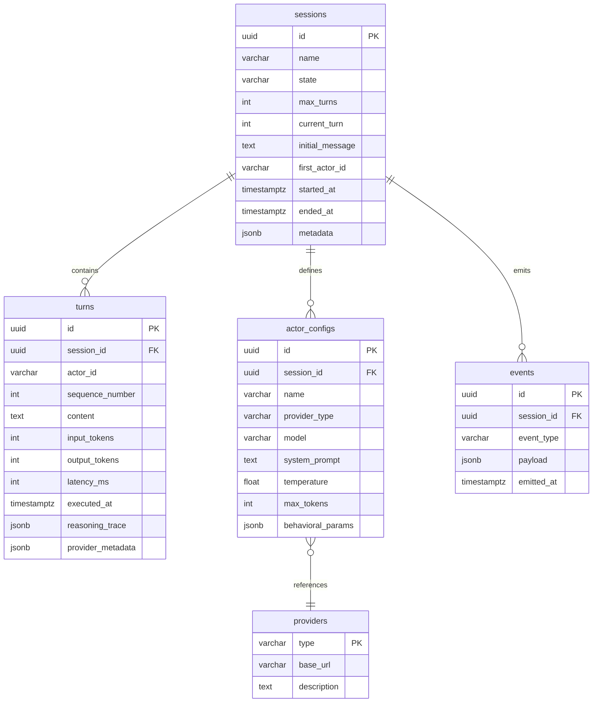

# Technical Specification: Emerge

**Version:** 1.0  
**Status:** Final  
**Date:** February 5, 2026  
**Principal Engineer:** Tech Lead (Agent)  
**Based On:** Architecture.md v2.0  

---

## 1. Stack Specification (Bill of Materials)

### 1.1 Runtime & Language

| Component | Version | Justification |
|-----------|---------|---------------|
| **Runtime** | Bun v1.3.8+ | Native TypeScript support, fastest SQLite driver, built-in HTTP/WebSocket server, zero-config bundler |
| **Language** | TypeScript 5.x | Static typing for LLM orchestration safety; strict mode enabled |
| **Package Manager** | Bun | Native runtime integration, lockfile v2 |

### 1.2 Primary Frameworks

| Component | Package | Version | Justification |
|-----------|---------|---------|---------------|
| **LLM Orchestration** | `langchain` | ^1.1.x | Provides `createAgent()` primitive; built-in ReAct reasoning loop; checkpointer interface |
| **Core Abstractions** | `@langchain/core` | ^1.1.x | Base LangChain abstractions for models, runnables, and schemas |
| **Provider SDKs** | `@langchain/ollama` | ^1.2.x | Native Ollama integration with streaming support |
| | `@langchain/openai` | ^1.2.x | Official OpenAI SDK with structured outputs |
| | `@langchain/anthropic` | ^1.3.x | Official Anthropic SDK with Claude support |
| **CLI Framework** | `@opentui/core` + `@opentui/react` | ^0.1.x | OpenTUI - Modern TypeScript TUI library with React bindings |
| **Web Server** | `Bun.serve()` | Built-in | Zero-config HTTP/WebSocket server; HMR for development |
| **Frontend Library** | React | 19.2.x | Component-based UI; compatible with HTML imports |
| **UI Components** | shadcn/ui (baseui) | Latest | Accessible, composable components; Base UI variant for unstyled primitives |
| **State Management** | TanStack Query | ^5.x | Server state caching; WebSocket polling integration |
| **Styling** | Tailwind CSS | 4.x | Utility-first CSS; shadcn/ui dependency |
| **Type Safety** | Zod | 4.x | Schema validation for structured outputs |

### 1.3 Data Stores

| Component | Technology | Purpose |
|-----------|------------|---------|
| **Primary Database** | SQLite 3.x (via `bun:sqlite`) | Session persistence, Turn history, Actor configs |
| **Checkpointer Storage** | SQLite (custom Bun implementation) | LangGraph state persistence per Actor thread |
| **Event Bus** | In-memory `EventEmitter` | Pub/sub for real-time state propagation |
| **Event Persistence** | SQLite `events` table | Replay capability, audit trail |

### 1.4 Infrastructure

| Component | Technology |
|-----------|------------|
| **Development Server** | `bun --hot` (Bun.serve HMR) |
| **Production Build** | `bun build` (single executable) |
| **Type Checking** | `bun tsc` (strict mode) |
| **Linting/Formatting** | Biome + Ultracite |

---

## 2. Architecture Decision Records (ADRs)

### ADR-001: LangChain createAgent() for Actor Implementation

**Context:**  
The PRD requires two LLM instances to engage in autonomous dialogue with strict alternation. A custom orchestration layer would require implementing reasoning traces, tool-use patterns, and state management from scratch.

**Decision:**  
Use LangChain's `createAgent()` function to implement each Actor as a LangGraph agent. Each Actor agent maintains its own conversation history and checkpointer state.

**Consequences:**
- ✅ **Built-in ReAct Reasoning:** Agents interleaving reasoning with tool calls is automatic
- ✅ **Structured Outputs:** LangChain's Zod integration ensures consistent Turn data schema
- ✅ **Checkpointer Integration:** Native support for custom Bun-based checkpointers
- ⚠️ **Framework Dependency:** Tied to LangChain's version lifecycle and API changes (^1.1.x)
- ⚠️ **Overhead:** Slight latency compared to direct Provider API calls (acceptable for research use)

**Implementation (verified API from langchain v1.1.x):**
```typescript
import { createAgent } from "langchain";
import { ChatOllama } from "@langchain/ollama";
import { z } from "zod";

const responseFormat = z.object({
  content: z.string().describe("The actor's response message"),
  tokens_used: z.number().describe("Total tokens used in this turn"),
  reasoning_steps: z.array(z.string()).optional().describe("ReAct reasoning trace"),
});

const actorAgent = createAgent({
  model: new ChatOllama({
    model: "llama3.1",
    temperature: 0.7,
  }),
  tools: [],  // No external tools for pure dialogue
  systemPrompt: "You are a thoughtful AI assistant...",  // System prompt
  responseFormat,
});
```

**Note:** The deprecated `createReactAgent` from `@langchain/langgraph` has been replaced by `createAgent` from the `langchain` package as of v1.1.x. The import path is `import { createAgent } from "langchain"`.

---

### ADR-002: Bun SQLite Checkpointer for Persistence

**Context:**  
The PRD specifies "no database required for MVP" but replay functionality requires state persistence. In-memory storage would lose Session data on restart.

**Decision:**  
Use the developer's custom Bun-based SQLite checkpointer from the start. Enable WAL mode for concurrent read/write performance.

**Consequences:**
- ✅ **Zero-Configuration:** SQLite requires no external server process
- ✅ **Persistence:** Sessions survive process restarts (true replay capability)
- ✅ **Queryability:** SQL queries enable Session search/filter (P2 feature)
- ✅ **Performance:** bun:sqlite is 3-6x faster than better-sqlite3
- ⚠️ **Single-Writer:** SQLite's locking model; no horizontal scaling (acceptable for solo dev)

**Implementation:**
```typescript
import { Database } from "bun:sqlite";
const db = new Database("emerge.sqlite", { create: true });
db.run("PRAGMA journal_mode = WAL;");
```

---

### ADR-003: In-Memory EventBus with WebSocket Bridge

**Context:**  
The Architecture requires real-time state propagation to both CLI and Web Dashboard. A separate message broker (Redis, RabbitMQ) introduces operational complexity.

**Decision:**  
Implement an in-memory `EventEmitter` pattern for single-node deployment. Bridge events to WebSocket connections via `Bun.serve()` for browser clients.

**Consequences:**
- ✅ **Zero Dependencies:** No Redis/Kafka required
- ✅ **Low Latency:** In-process event delivery
- ✅ **Simple Debugging:** All events visible in process memory
- ⚠️ **Single-Node Only:** Events not persisted across process restarts
- ⚠️ **No Horizontal Scale:** Would require external broker for multi-node deployment

**Implementation:**
```typescript
class EventBus extends EventEmitter {
  broadcast(event: Event): void {
    this.emit(event.type, event);
    // Also push to WebSocket connections
  }
}
```

---

### ADR-004: OpenTUI for CLI Interface

**Context:**  
The PRD requires a terminal interface for real-time monitoring and control. CLI frameworks range from simple (Commander.js) to TUI-native (Ink, Blessed).

**Decision:**  
Use **OpenTUI** (`@opentui/core` and `@opentui/react`) for the CLI interface. It provides a modern, Rust-based TUI experience with React bindings for declarative component construction.

**Consequences:**
- ✅ **Modern UX:** Better visual hierarchy than traditional TUI libraries
- ✅ **React Integration:** `@opentui/react` provides familiar React patterns for TUI development
- ✅ **Keyboard Navigation:** Full keyboard support for interactive sessions
- ✅ **Performance:** Rust-based rendering is fast and flicker-free
- ✅ **TypeScript First:** Excellent type safety with first-class TS support
- ⚠️ **Learning Curve:** API differs from traditional Node.js TUI libraries
- ⚠️ **Version 0.1.x:** Still early-stage; API may evolve

**Installation:**
```bash
bun install @opentui/core @opentui/react
```

---

### ADR-005: shadcn/ui (baseui) + TanStack Query for Web Dashboard

**Context:**  
The PRD requires a browser-based UI for Session visualization and replay. React alone provides no state management or component library.

**Decision:**  
Use **shadcn/ui** (the baseui variant, not Radix) for accessible components styled with Tailwind CSS. Use **TanStack Query** for server state management and WebSocket integration.

**Consequences:**
- ✅ **Accessibility:** shadcn/ui components are WCAG-compliant out of the box
- ✅ **Customization:** Tailwind allows complete design control
- ✅ **State Management:** TanStack Query handles caching, invalidation, and polling
- ✅ **Real-time Updates:** TanStack Query's `useQuery` with WebSocket integration
- ⚠️ **Bundle Size:** shadcn/ui includes components individually; monitor tree-shaking

---

## 3. Database Schema (Physical ERD)

### 3.1 Schema Overview



### 3.2 Table Definitions

#### `sessions`

| Column | Type | Constraint | Description |
|--------|------|------------|-------------|
| `id` | `UUID` | PRIMARY KEY | Session identifier |
| `name` | `VARCHAR(255)` | NOT NULL | Human-readable session name |
| `state` | `VARCHAR(50)` | NOT NULL, DEFAULT 'IDLE' | Session state (IDLE, RUNNING, PAUSED, TERMINATED) |
| `max_turns` | `INTEGER` | NOT NULL, DEFAULT 100 | Maximum turns before auto-termination |
| `current_turn` | `INTEGER` | NOT NULL, DEFAULT 0 | Current turn number |
| `initial_message` | `TEXT` | NULL | The prompt that started the conversation |
| `first_actor_id` | `UUID` | NULL | FK to actor_configs.id |
| `started_at` | `TIMESTAMPTZ` | NOT NULL | Session creation timestamp |
| `ended_at` | `TIMESTAMPTZ` | NULL | Session termination timestamp |
| `metadata` | `JSONB` | NULL | Arbitrary session metadata |

**Indexes:**
- `idx_sessions_state` ON `sessions(state)`
- `idx_sessions_started_at` ON `sessions(started_at DESC)`

#### `turns`

| Column | Type | Constraint | Description |
|--------|------|------------|-------------|
| `id` | `UUID` | PRIMARY KEY | Turn identifier |
| `session_id` | `UUID` | NOT NULL, FK → `sessions.id` | Parent session |
| `actor_id` | `UUID` | NOT NULL, FK → `actor_configs.id` | Actor that generated this turn |
| `sequence_number` | `INTEGER` | NOT NULL | Order within session (1, 2, 3...) |
| `content` | `TEXT` | NOT NULL | The turn's message content |
| `input_tokens` | `INTEGER` | NULL | Tokens sent to provider |
| `output_tokens` | `INTEGER` | NULL | Tokens received from provider |
| `latency_ms` | `INTEGER` | NULL | Provider response time |
| `executed_at` | `TIMESTAMPTZ` | NOT NULL | Turn execution timestamp |
| `reasoning_trace` | `JSONB` | NULL | ReAct reasoning steps |
| `provider_metadata` | `JSONB` | NULL | Provider-specific response data |

**Indexes:**
- `idx_turns_session_id` ON `turns(session_id)`
- `idx_turns_sequence` ON `turns(session_id, sequence_number)`

#### `actor_configs`

| Column | Type | Constraint | Description |
|--------|------|------------|-------------|
| `id` | `UUID` | PRIMARY KEY | Actor configuration identifier |
| `session_id` | `UUID` | NOT NULL, FK → `sessions.id` | Parent session |
| `name` | `VARCHAR(255)` | NOT NULL | Display name (e.g., "Actor A") |
| `provider_type` | `VARCHAR(50)` | NOT NULL | Provider (OLLAMA, OPENAI, ANTHROPIC) |
| `model` | `VARCHAR(255)` | NOT NULL | Model identifier |
| `system_prompt` | `TEXT` | NOT NULL | System prompt for this actor |
| `temperature` | `FLOAT` | NOT NULL, DEFAULT 0.7 | LLM temperature setting |
| `max_tokens` | `INTEGER` | NOT NULL, DEFAULT 1024 | Max tokens per response |
| `behavioral_params` | `JSONB` | NULL | Additional behavioral configuration |

#### `events`

| Column | Type | Constraint | Description |
|--------|------|------------|-------------|
| `id` | `UUID` | PRIMARY KEY | Event identifier |
| `session_id` | `UUID` | NOT NULL, FK → `sessions.id` | Parent session |
| `event_type` | `VARCHAR(100)` | NOT NULL | Event type (TurnExecuted, SessionStateChanged, etc.) |
| `payload` | `JSONB` | NOT NULL | Event data |
| `emitted_at` | `TIMESTAMPTZ` | NOT NULL | Event emission timestamp |

**Indexes:**
- `idx_events_session_id` ON `events(session_id)`
- `idx_events_type` ON `events(event_type)`

---

## 4. API Contract (OpenAPI 3.0)

### 4.1 WebSocket API (Real-Time Events)

**Connection:** `ws://localhost:3000/ws`

#### Message Format

```yaml
type: object
properties:
  type:
    type: string
    enum:
      - session.created
      - session.started
      - session.paused
      - session.resumed
      - session.terminated
      - turn.executed
      - turn.error
      - error.occurred
  sessionId:
    type: string
    format: uuid
  timestamp:
    type: string
    format: date-time
  payload:
    type: object
```

#### Event Payloads

**`session.created`**
```yaml
type: object
properties:
  sessionId: { type: string, format: uuid }
  actors:
    - id: { type: string, format: uuid }
      name: string
      provider: string
      model: string
    - id: { type: string, format: uuid }
      name: string
      provider: string
      model: string
```

**`turn.executed`**
```yaml
type: object
properties:
  turnId: { type: string, format: uuid }
  sessionId: { type: string, format: uuid }
  actorId: { type: string, format: uuid }
  actorName: string
  sequenceNumber: integer
  content: string
  tokens:
    input: integer
    output: integer
  latencyMs: integer
  timestamp: { type: string, format: date-time }
```

**`session.state_changed`**
```yaml
type: object
properties:
  sessionId: { type: string, format: uuid }
  previousState:
    type: string
    enum: [IDLE, RUNNING, PAUSED, TERMINATED]
  newState:
    type: string
    enum: [IDLE, RUNNING, PAUSED, TERMINATED]
  reason: string
```

### 4.2 HTTP REST API

**Base URL:** `http://localhost:3000/api`

#### Endpoints

##### `POST /sessions`

Create a new Session.

```yaml
paths:
  /sessions:
    post:
      summary: Create a new Session
      requestBody:
        required: true
        content:
          application/json:
            schema:
              $ref: '#/components/schemas/CreateSessionRequest'
      responses:
        '201':
          description: Session created successfully
          content:
            application/json:
              schema:
                $ref: '#/components/schemas/SessionResponse'
        '400':
          description: Invalid configuration
```

##### `GET /sessions`

List all Sessions.

```yaml
paths:
  /sessions:
    get:
      summary: List all Sessions
      parameters:
        - name: state
          in: query
          schema:
            type: string
            enum: [IDLE, RUNNING, PAUSED, TERMINATED]
        - name: limit
          in: query
          schema:
            type: integer
            default: 20
      responses:
        '200':
          description: List of sessions
```

##### `GET /sessions/{id}`

Get Session details including Turns.

```yaml
paths:
  /sessions/{id}:
    get:
      summary: Get Session by ID
      parameters:
        - name: id
          in: path
          required: true
          schema:
            type: string
            format: uuid
      responses:
        '200':
          description: Session details
```

##### `POST /sessions/{id}/start`

Start a paused or idle Session.

```yaml
paths:
  /sessions/{id}/start:
    post:
      summary: Start Session execution
      parameters:
        - name: id
          in: path
          required: true
          schema:
            type: string
            format: uuid
      responses:
        '200':
          description: Session started
```

##### `POST /sessions/{id}/pause`

Pause an active Session.

```yaml
paths:
  /sessions/{id}/pause:
    post:
      summary: Pause Session execution
      parameters:
        - name: id
          in: path
          required: true
          schema:
            type: string
            format: uuid
      responses:
        '200':
          description: Session paused
```

##### `POST /sessions/{id}/inject`

Inject a topic into the next Turn.

```yaml
paths:
  /sessions/{id}/inject:
    post:
      summary: Inject a topic prompt
      parameters:
        - name: id
          in: path
          required: true
          schema:
            type: string
            format: uuid
      requestBody:
        required: true
        content:
          application/json:
            schema:
              type: object
              properties:
                topic:
                  type: string
                  description: The topic to inject
                actorId:
                  type: string
                  format: uuid
                  description: Target actor (optional, defaults to next turn's actor)
      responses:
        '200':
          description: Topic injected
```

##### `POST /sessions/{id}/export`

Export Session to JSON or Markdown.

```yaml
paths:
  /sessions/{id}/export:
    post:
      summary: Export Session
      parameters:
        - name: id
          in: path
          required: true
          schema:
            type: string
            format: uuid
      requestBody:
        required: true
        content:
          application/json:
            schema:
              type: object
              properties:
                format:
                  type: string
                  enum: [json, markdown]
                includeMetadata:
                  type: boolean
                  default: true
      responses:
        '200':
          description: Export file generated
          content:
            application/json:
              schema:
                type: object
                properties:
                  filePath:
                    type: string
```

##### `GET /sessions/{id}/replay`

Stream Session replay to WebSocket.

```yaml
paths:
  /sessions/{id}/replay:
    get:
      summary: Stream Session replay
      parameters:
        - name: id
          in: path
          required: true
          schema:
            type: string
            format: uuid
      responses:
        '101':
          description: Switching protocols to WebSocket replay
```

#### Schema Definitions

```yaml
components:
  schemas:
    CreateSessionRequest:
      type: object
      required:
        - name
        - actorA
        - actorB
        - initialMessage
      properties:
        name:
          type: string
          maxLength: 255
        actorA:
          $ref: '#/components/schemas/ActorConfig'
        actorB:
          $ref: '#/components/schemas/ActorConfig'
        initialMessage:
          type: string
        maxTurns:
          type: integer
          default: 100
        firstActor:
          type: string
          enum: [A, B]
          default: A
    
    ActorConfig:
      type: object
      required:
        - name
        - provider
        - model
        - systemPrompt
      properties:
        name:
          type: string
          maxLength: 255
        provider:
          type: string
          enum: [OLLAMA, OPENAI, ANTHROPIC]
        model:
          type: string
          maxLength: 255
        systemPrompt:
          type: string
        temperature:
          type: number
          minimum: 0
          maximum: 2
          default: 0.7
        maxTokens:
          type: integer
          minimum: 1
          maximum: 128000
          default: 1024
    
    SessionResponse:
      type: object
      properties:
        id:
          type: string
          format: uuid
        name:
          type: string
        state:
          type: string
          enum: [IDLE, RUNNING, PAUSED, TERMINATED]
        currentTurn:
          type: integer
        maxTurns:
          type: integer
        startedAt:
          type: string
          format: date-time
        endedAt:
          type: string
          format: date-time
```

---

## 5. Implementation Guidelines

### 5.1 Project Structure

```
emerge/
├── src/
│   ├── domain/
│   │   ├── Session.ts
│   │   ├── Turn.ts
│   │   ├── Actor.ts
│   │   ├── ActorConfig.ts
│   │   ├── SessionState.ts
│   │   └── events/
│   │       ├── Event.ts
│   │       └── EventTypes.ts
│   ├── agents/
│   │   ├── ActorAgentFactory.ts
│   │   ├── AgentCheckpointer.ts
│   │   └── responseSchemas.ts
│   ├── providers/
│   │   ├── ProviderFactory.ts
│   │   ├── OllamaProvider.ts
│   │   ├── OpenAIProvider.ts
│   │   └── AnthropicProvider.ts
│   ├── persistence/
│   │   ├── Database.ts
│   │   ├── repositories/
│   │   │   ├── SessionRepository.ts
│   │   │   ├── TurnRepository.ts
│   │   │   └── EventRepository.ts
│   │   └── migrations/
│   │       └── 001_initial_schema.sql
│   ├── orchestration/
│   │   ├── SessionOrchestrator.ts
│   │   ├── TurnExecutor.ts
│   │   └── StateMachine.ts
│   ├── events/
│   │   ├── EventBus.ts
│   │   └── EventHandler.ts
│   ├── cli/
│   │   ├── index.ts
│   │   ├── commands/
│   │   │   ├── startSession.ts
│   │   │   ├── pauseSession.ts
│   │   │   ├── injectTopic.ts
│   │   │   └── exportSession.ts
│   │   └── ui/
│   │       ├── Dashboard.tsx
│   │       └── TurnDisplay.tsx
│   ├── web/
│   │   ├── server/
│   │   │   ├── index.ts
│   │   │   ├── routes/
│   │   │   │   ├── sessions.ts
│   │   │   │   └── export.ts
│   │   │   └── websocket/
│   │   │       └── ReplayStream.ts
│   │   ├── components/
│   │   │   ├── ui/
│   │   │   │   ├── button.tsx
│   │   │   │   ├── card.tsx
│   │   │   │   └── dialog.tsx
│   │   │   ├── SessionList.tsx
│   │   │   ├── SessionDetail.tsx
│   │   │   ├── TurnTimeline.tsx
│   │   │   └── SessionControls.tsx
│   │   ├── hooks/
│   │   │   ├── useSession.ts
│   │   │   ├── useEventStream.ts
│   │   │   └── useReplay.ts
│   │   └── App.tsx
│   └── export/
│       ├── ExportEngine.ts
│       ├── formatters/
│       │   ├── JsonFormatter.ts
│       │   └── MarkdownFormatter.ts
│       └── templates/
│           └── sessionReport.md
├── package.json
├── bunfig.toml
├── tsconfig.json
├── biome.jsonc
├── .env.example
└── emerge.sqlite
```

### 5.2 Coding Standards

#### TypeScript Strict Mode

All TypeScript code must compile with `tsc --strict`. No `any` types unless absolutely necessary. Use `unknown` for genuinely unknown types.

#### Domain-Driven Design

- **Domain entities** reside in `/src/domain` and contain no framework imports
- **Application services** reside in `/src/orchestration` and depend on domain
- **Infrastructure** (database, HTTP, providers) depends on domain via interfaces

#### Event Sourcing Pattern

All state changes flow through the `EventBus`:

```typescript
// Domain event definition
class SessionStartedEvent extends Event {
  constructor(
    public readonly sessionId: UUID,
    public readonly actorId: UUID
  ) {
    super('session.started');
  }
}

// Event publication
eventBus.publish(new SessionStartedEvent(session.id, actor.id));
```

#### Error Handling

All errors include context:

```typescript
class TurnExecutionError extends Error {
  constructor(
    message: string,
    public readonly sessionId: UUID,
    public readonly turnId: UUID,
    public readonly actorId: UUID,
    public readonly providerError?: unknown
  ) {
    super(message);
  }
}
```

#### Async/Await Patterns

- All async functions must handle errors with try/catch
- No bare promise chains; use async/await
- Parallel independent operations use `Promise.all()`

### 5.3 Checkpointer Interface

The developer's Bun-based checkpointer must implement LangGraph's `BaseCheckpointSaver` interface from `@langchain/langgraph` v1.1.x:

```typescript
import type { BaseCheckpointSaver, Checkpoint, RunnableConfig } from "@langchain/langgraph";

interface BunCheckpointer extends BaseCheckpointSaver {
  // Required methods from BaseCheckpointSaver (v1.1.x API)
  get(config: RunnableConfig): Promise<Checkpoint | null>;
  put(
    config: RunnableConfig,
    checkpoint: Checkpoint,
    metadata: Record<string, unknown>,
    newVersions?: Record<string, string>
  ): Promise<RunnableConfig>;
  list(config: RunnableConfig): AsyncGenerator<Checkpoint[], void, unknown>;
  
  // Custom Bun-specific methods
  getThreadHistory(threadId: string): Promise<Array<{ state: unknown; metadata: unknown }>>;
  clear(threadId: string): Promise<void>;
}
```

### 5.4 Provider Integration

Each provider is initialized via LangChain's provider packages:

```typescript
// providerFactory.ts
type ProviderType = 'OLLAMA' | 'OPENAI' | 'ANTHROPIC';

async function createProvider(
  type: ProviderType,
  config: ActorConfig
): Promise<BaseChatModel> {
  switch (type) {
    case 'OLLAMA':
      return new ChatOllama({
        model: config.model,
        temperature: config.temperature,
        maxTokens: config.maxTokens,
      });
    case 'OPENAI':
      return new ChatOpenAI({
        model: config.model,
        temperature: config.temperature,
        maxTokens: config.maxTokens,
        apiKey: process.env.OPENAI_API_KEY,
      });
    case 'ANTHROPIC':
      return new ChatAnthropic({
        model: config.model,
        temperature: config.temperature,
        maxTokens: config.maxTokens,
        apiKey: process.env.ANTHROPIC_API_KEY,
      });
  }
}
```

### 5.5 Turn Execution Flow

```typescript
async function executeTurn(
  session: Session,
  actor: Actor,
  conversationHistory: BaseMessage[]
): Promise<Turn> {
  const startTime = Date.now();
  
  // Invoke actor agent with conversation history
  const result = await actor.agent.invoke(
    { messages: conversationHistory },
    { configurable: { thread_id: session.id } }
  );
  
  const latency = Date.now() - startTime;
  
  // Extract structured response
  const { content, tokens_used, reasoning_steps } = result;
  
  // Create Turn entity
  const turn = Turn.create({
    sessionId: session.id,
    actorId: actor.id,
    sequenceNumber: session.currentTurn + 1,
    content,
    inputTokens: tokens_used.input,
    outputTokens: tokens_used.output,
    latencyMs: latency,
    reasoningTrace: reasoning_steps,
  });
  
  // Persist turn
  await turnRepository.save(turn);
  
  // Emit event
  eventBus.publish(new TurnExecutedEvent(turn));
  
  return turn;
}
```

### 5.6 Session State Machine

```typescript
enum SessionState {
  IDLE = 'IDLE',
  RUNNING = 'RUNNING',
  PAUSED = 'PAUSED',
  TERMINATED = 'TERMINATED',
}

class SessionStateMachine {
  private state: SessionState = SessionState.IDLE;
  private transitions: Record<SessionState, SessionState[]> = {
    [SessionState.IDLE]: [SessionState.RUNNING, SessionState.TERMINATED],
    [SessionState.RUNNING]: [SessionState.PAUSED, SessionState.TERMINATED],
    [SessionState.PAUSED]: [SessionState.RUNNING, SessionState.TERMINATED],
    [SessionState.TERMINATED]: [],
  };
  
  transition(newState: SessionState): void {
    const allowed = this.transitions[this.state];
    if (!allowed.includes(newState)) {
      throw new InvalidStateTransitionError(this.state, newState);
    }
    this.state = newState;
  }
}
```

### 5.7 WebSocket Event Bridge

```typescript
// Bridge in-memory events to WebSocket connections
class WebSocketEventBridge {
  private connections: Set<WebSocket> = new Set();
  
  constructor(private eventBus: EventBus) {
    eventBus.on('*', (event: Event) => {
      this.broadcast(event);
    });
  }
  
  addConnection(ws: WebSocket): void {
    this.connections.add(ws);
    ws.onclose = () => {
      this.connections.delete(ws);
    };
  }
  
  private broadcast(event: Event): void {
    const message = JSON.stringify({
      type: event.type,
      sessionId: event.sessionId,
      timestamp: new Date().toISOString(),
      payload: event,
    });
    
    for (const connection of this.connections) {
      connection.send(message);
    }
  }
}
```

---

## 6. Configuration

### 6.1 Environment Variables

```yaml
# .env.example

# Server
PORT=3000
HOST=0.0.0.0

# Ollama (Local)
OLLAMA_BASE_URL=http://localhost:11434
OLLAMA_MODEL=llama3.1

# OpenAI
OPENAI_API_KEY=sk-...

# Anthropic
ANTHROPIC_API_KEY=sk-ant-...

# Database
DATABASE_PATH=./emerge.sqlite

# Session Defaults
DEFAULT_MAX_TURNS=100
DEFAULT_TEMPERATURE=0.7
```

### 6.2 YAML Configuration File

```yaml
# config.yaml
app:
  host: 0.0.0.0
  port: 3000

database:
  path: ./emerge.sqlite
  wal_mode: true

providers:
  ollama:
    base_url: http://localhost:11434
    default_model: llama3.1
  openai:
    api_key_env: OPENAI_API_KEY
    default_model: gpt-4o
  anthropic:
    api_key_env: ANTHROPIC_API_KEY
    default_model: claude-sonnet-4-5-20250929

session:
  default_max_turns: 100
  max_consecutive_failures: 3
  retry_empty_response: true

cli:
  theme: dark
  refresh_rate_ms: 100

dashboard:
  default_view: timeline
  show_reasoning_traces: false
```

---

## 7. Testing Strategy

### 7.1 Unit Tests

**Framework:** Bun Test (`bun test`)

**Coverage Requirements:**
- ✅ Session state machine transitions
- ✅ Turn execution and validation
- ✅ Actor agent factory
- ✅ Event bus publishing/subscription
- ✅ Repository CRUD operations
- ✅ Export formatters (JSON, Markdown)

**Example:**
```typescript
import { test, expect } from "bun:test";
import { SessionStateMachine } from "./SessionStateMachine";

test("transition from RUNNING to PAUSED is valid", () => {
  const machine = new SessionStateMachine();
  machine.transition(SessionState.RUNNING);
  machine.transition(SessionState.PAUSED);
  expect(machine.state).toBe(SessionState.PAUSED);
});

test("transition from TERMINATED is invalid", () => {
  const machine = new SessionStateMachine();
  machine.transition(SessionState.IDLE);
  machine.transition(SessionState.RUNNING);
  machine.transition(SessionState.TERMINATED);
  expect(() => machine.transition(SessionState.RUNNING)).toThrow();
});
```

### 7.2 Integration Tests

**Test Scenarios:**
- Full Session lifecycle (create → start → pause → resume → terminate)
- Turn execution with both actors
- Provider failure handling
- Event bus propagation
- WebSocket connection and event streaming
- Session replay

### 7.3 E2E Tests

**Tool:** Playwright

**Scenarios:**
- CLI command execution
- Web Dashboard interaction
- Session creation via UI
- Export functionality

---

## 8. Build & Deployment

### 8.1 Development

```bash
# Start development server with HMR
bun --hot src/web/server/index.ts

# Run type checking
bun tsc --noEmit

# Run linter
bun x biome check

# Run tests
bun test
```

### 8.2 Production Build

```bash
# Compile TypeScript and bundle
bun build src/web/server/index.ts --outfile emerge

# Or build as library
bun build src/index.ts --outfile emerge.js --format esm
```

### 8.3 Database Migration

```bash
# Run migrations
bun run src/persistence/migrate.ts

# Seed initial data (if needed)
bun run src/persistence/seed.ts
```

---

## 9. Appendix: Turn Schema (Zod)

```typescript
import { z } from "zod";

export const TurnSchema = z.object({
  id: z.string().uuid(),
  sessionId: z.string().uuid(),
  actorId: z.string().uuid(),
  sequenceNumber: z.number().int().positive(),
  content: z.string().min(1),
  inputTokens: z.number().int().nonnegative(),
  outputTokens: z.number().int().nonnegative(),
  latencyMs: z.number().int().nonnegative(),
  executedAt: z.string().datetime(),
  reasoningTrace: z.array(z.string()).optional(),
  providerMetadata: z.object({
    model: z.string(),
    provider: z.enum(['OLLAMA', 'OPENAI', 'ANTHROPIC']),
    finishReason: z.string().optional(),
  }).optional(),
});

export type Turn = z.infer<typeof TurnSchema>;
```

---

## 10. Verified Package Versions (February 2026)

The following versions have been **verified against current npm/Bun releases** as of February 2026:

### Core Runtime & Language
| Package | Current Version | Installation |
|---------|----------------|--------------|
| **Bun** | v1.3.8 | `curl -fsSL https://bun.sh/install \| bash` |
| **TypeScript** | 5.x | Bundled with Bun |

### LangChain Ecosystem
| Package | Current Version | Installation |
|---------|----------------|--------------|
| **langchain** | **1.2.17** | `bun add langchain` (exports `createAgent`) |
| `@langchain/langgraph` | **1.1.2** | Bundled with langchain |
| `@langchain/core` | **1.1.18** | Bundled with langchain |
| `@langchain/ollama` | **1.2.1** | `bun add @langchain/ollama` |
| `@langchain/openai` | **1.2.4** | `bun add @langchain/openai` |
| `@langchain/anthropic` | **1.3.12** | `bun add @langchain/anthropic` |

**Critical API Change:** As of langchain v1.x, `createAgent` is exported from `langchain` package:
```typescript
import { createAgent } from "langchain";  // ✅ Correct
// import { createAgent } from "@langchain/langgraph";  // ❌ Deprecated
```

**Note:** All LangChain packages must share the same `@langchain/core` version for compatibility.

### Validation
| Package | Current Version | Installation |
|---------|----------------|--------------|
| **Zod** | **4.3.6** | `bun add zod` |

### CLI Framework (OpenTUI)
| Package | Current Version | Installation |
|---------|----------------|--------------|
| `@opentui/core` | **0.1.77** | `bun add @opentui/core` |
| `@opentui/react` | **0.1.74** | `bun add @opentui/react @opentui/core react` |

### Web Dashboard
| Package | Current Version | Installation |
|---------|----------------|--------------|
| **React** | **19.2.4** | `bun add react react-dom` |
| `@tanstack/react-query` | **5.90.20** | `bun add @tanstack/react-query` |
| **shadcn CLI** | **3.7.0** | `npx shadcn@latest init` |
| **radix-ui** (unified) | **1.4.3** | Auto-installed via shadcn |
| **Tailwind CSS** | **4.1.18** | Auto-installed via shadcn |

### Database
| Package | Current Version | Installation |
|---------|----------------|--------------|
| SQLite | 3.x (via `bun:sqlite`) | Built-in to Bun runtime |

---

**Document Version:** 1.1  
**Generated By:** Tech Lead (Agent)  
**Based On:** Architecture.md v2.0 (Final)  
**Version Notes:** Updated with verified npm versions as of February 2026  
**Next Step:** Implementation begins per this specification